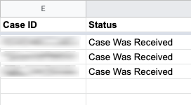

# gsUSCIS
USCIS Case Status checker Google Function

# Setup
1. Open your Google Sheets
2. Tools > Script Editor
3. Paste USCIS.gs within this github project and save it on your project. You can save in any project name or script name.
4. Back to your Google Sheets
5. In the cell you want to show USCIS status, add following function.
```
=USCIS("ABC1234567890")
```
For example, if your CASE ID is ABC1234567890 and stored in A2 cell, add following function in B2 cell then you will see the status of the case.
```
=USCIS(A2)
```
6. USCIS case status is shown on the cell.

# Screen shot
<div align="center">
  
</div>

# Service
* USCIS Case Status Online https://egov.uscis.gov/casestatus/landing.do

# History
## June 3, 2021
* v0.1: USCIS Case Status retrieval
